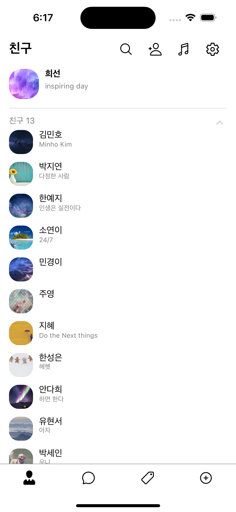
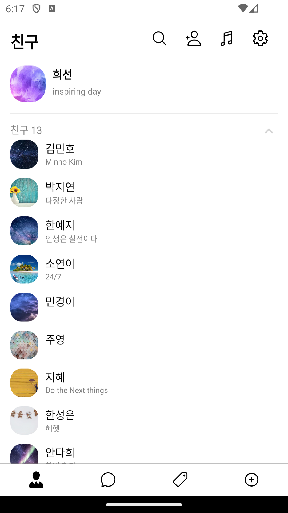

# React Native - Kakao Friend List

React Native로 만든 카카오톡 친구목록 UI 클론코딩입니다.  
IOS, Android 둘 다 시뮬레이터에서 정상 작동합니다.

### 완성사진

  
  

### 작업내용

- 내 프로필, 친구리스트 컴포넌트 생성
- 친구리스트 Toggle 기능 추가
- 하단 탭바 컴포넌트 생성

### 기술스택

React Native, Styled-components, react-native-safe-area-context
